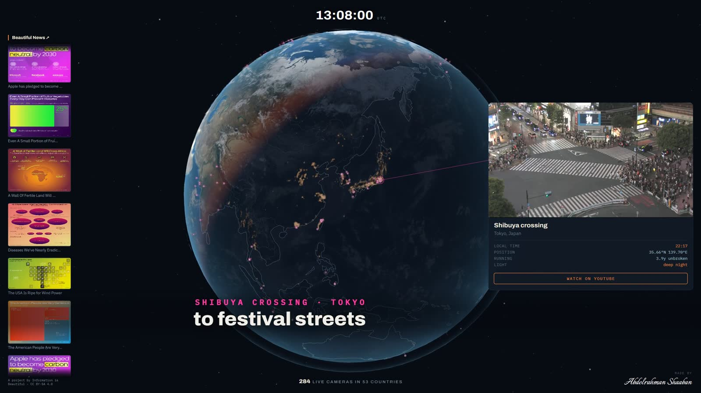
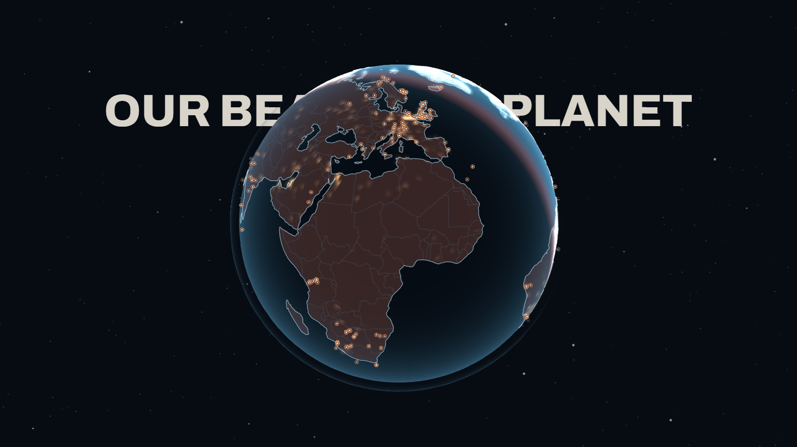

# Our Beautiful Planet

**[View it live →](https://our-beautiful-planet.vercel.app)**

A spinning Earth carrying **284 live webcams across 53 countries**. Hover a pin and
you see what is happening there right now; click and it opens the stream.

The globe is lit from the real subsolar point, so half the cameras are genuinely
in darkness at any moment and you can see which — that is the whole idea, not a
decoration.



No build step, no framework, no `node_modules`. WebGL2 through a native import map,
with a 2D-canvas fallback and a plain list for browsers that have neither.

```bash
python serve.py          # http://127.0.0.1:8777  (sends no-store)
```



## Layout

| Path | What it is |
|---|---|
| `index.html` | The whole shell: importmap, tokens, monitor, HUD, news rail |
| `js/boot.js` | URL flags → WebGL2 gate → tier → `app.js` or `fallback.js` |
| `js/app.js` | The spine. One renderer, one rAF, one resize path |
| `js/globe.js` | Planet body, land particles, atmosphere, stars, camera controls |
| `js/geo.js` | Pure geometry. **The coordinate convention lives here** |
| `js/atlas.js` | Natural Earth → coastlines, borders, land-mask raster |
| `js/lights.js` | NASA Black Marble read as data to weight the night side |
| `js/sun.js` | Subsolar point, solar elevation, local time |
| `js/pins.js` `js/pick.js` `js/monitor.js` | Markers, hit-testing, the docked preview |
| `js/news.js` | The Beautiful News rail |
| `js/selftest.js` | Geographic invariants (`?check=1`) |
| `livecams.json` | The camera dataset |
| `data/` | Vendored Natural Earth, Black Marble, cached news |

Three Python scripts maintain the data and none of them ship (`.vercelignore`):
`refresh.py` (cameras), `news.py` (Beautiful News), `tz.py` (timezones).

## URL flags

| Flag | Effect |
|---|---|
| `?check=1` | Run the geographic self-test; results in the console |
| `?utc=2026-06-21T12:00:00Z` | Freeze the sun at a known instant |
| `?tier=base\|mid\|high` | Force a quality tier |
| `?grid=1` | Force the no-WebGL list |
| `?stats` | Log draw calls and triangle counts |
| `?borders=50m` | Higher-detail coastlines (756 KB; screenshots only) |

## The one thing to know before editing

**The minus sign on `x` in `geo.latLonToVec3` is load-bearing.** Without it the
world is mirrored east–west — you are looking at the Earth from the inside, with
Madagascar on the wrong side of Africa.

That bug shipped once and survived a long time, because it was perfectly
self-consistent: coastlines agreed with the land mask, pins agreed with the
coastlines, the terminator agreed with the pins. Every check that compared the
app to *itself* passed.

So `js/selftest.js` compares the app to the actual Earth instead — real city
longitudes, known land and ocean probes, the 0.29 land fraction, solstice
geometry, named capes. Run it after touching `geo.js`, the shaders, or the
sampler:

```bash
python serve.py
```

then open `http://127.0.0.1:8777/?check=1` and read the console. Ten assertions;
they should all pass.

The convention is duplicated in three places that must move together: `geo.js`,
the inline sampler in `globe.js`, and the inverse mapping in
`js/shaders/globe.glsl.js`.

## Keeping the data alive

```bash
python refresh.py --write     # re-verify cameras, fail over, drop dead streams
python news.py --write        # re-cache Beautiful News
python tz.py --write          # re-derive timezones (only after adding cameras)
```

`refresh.py` costs about 3 YouTube API quota units of 10,000/day and reuses the
`yt` CLI's auth, so there is nothing extra to configure. Run it before deploying;
live streams do end. The HUD shows the list's age once it passes 45 days.

`uptime_days` is the length of the current unbroken stream session. A low number
means *unproven*, not unreliable — EarthCam's whole fleet restarts together.

## Credits and licences

- Coastlines and borders: **Natural Earth** via `world-atlas`, public domain
- Night lights: **NASA Black Marble** composite, public domain, used as data
- Beautiful News: **Information is Beautiful**, CC BY-SA 4.0, attributed on-page
- Streams belong to their operators; the page links out and never re-hosts

## Known gaps

No cameras in mainland China (YouTube is blocked there), Egypt, Turkey, or
Antarctica, and only one in London — the better London cams have embedding
disabled, which renders as a black box rather than a picture. Coverage skews to
Europe and North America. The HUD states the real country count rather than
implying the whole world is covered.
